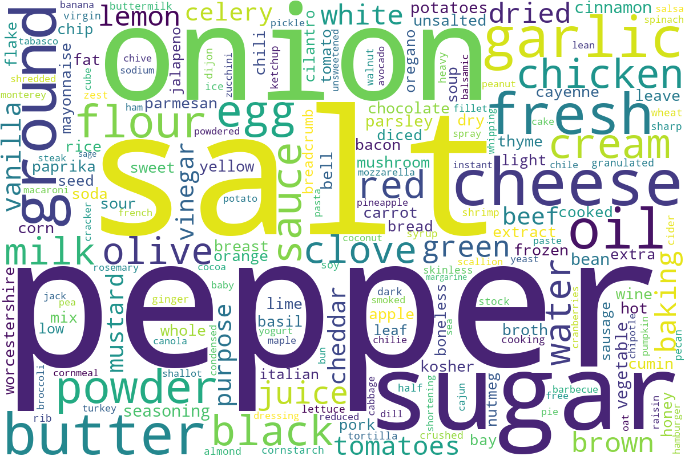
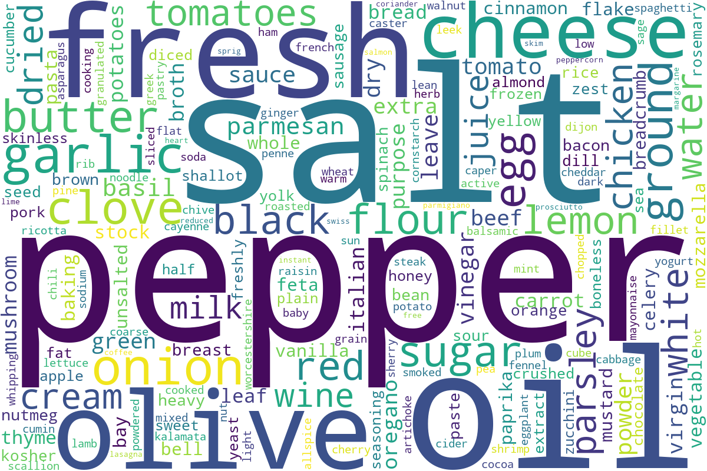

# Cuisine Classifier 🍽️ <br>
By Tanvi Vidyala and Nithya Nair

## Introduction
For our project, we wanted to investigate whether European food is actually healthier than American food by comparing the nutritional information in American recipes to that of European recipes and see if we could distinguish a European recipe from an American recipe through a classification model. For the purposes of our study, we define a healthier recipe to be one that has a substantially lower amount of sugar, carbs, sodium, and fat.

The datasets we use contain information from [food.com](food.com) and were originally scraped for the paper [Generating Personalized Recipes from Historical User Preferences](https://cseweb.ucsd.edu/~jmcauley/pdfs/emnlp19c.pdf) by Majumder et al. The recipes dataset has **83,782 rows** and **12 columns**. Each row represents one recipe. The columns contain the following information:

| Column           | Description                                                                                                                                                                       |
|------------------|-----------------------------------------------------------------------------------------------------------------------------------------------------------------------------------|
| `NAME`           | Recipe name                                                                                                                                                                       |
| `ID`             | Recipe ID                                                                                                                                                                         |
| `MINUTES`        | Minutes to prepare recipe                                                                                                                                                         |
| `CONTRIBUTER_ID` | User ID who submitted this recipe                                                                                                                                                 |
| `SUBMITTED`      | Date recipe was submitted                                                                                                                                                         |
| `TAGS`           | Food.com tags for recipe                                                                                                                                                          |
| `NUTRITION`      | Nutrition information in the form `[calories (#), total fat (PDV), sugar (PDV), sodium (PDV), protein (PDV), saturated fat (PDV), carbohydrates (PDV)]`; PDV = percentage of daily value |
| `N_STEPS`        | Number of steps in recipe                                                                                                                                                         |
| `STEPS`          | Text for recipe steps, in order                                                                                                                                                   |
| `DESCRIPTION`    | User-provided description                                                                                                                                                         |

The interactions dataset contains 731,927 rows and 5 columns. Each row represents one review of a recipe. The columns for this dataset include the following information:

| Column     | Description            |
|-----------|--------------------------|
| `USER_ID`   | User ID                  |
| `RECIPE_ID` | Recipe ID                |
| `DATE`      | Date of interaction      |
| `RATING`    | Rating given             |
| `REVIEW`    | Review text              |

## Data Cleaning and Exploratory Data Analysis
Before we could begin the data cleaning process, we had to:
- Merge the recipes and interactions dataset
- Fill all ratings of 0 with `np.nan` (ratings of 0 mean that the user likely didn’t rate the recipe; replacing these ratings with np.nan means that the average rating won’t be affected by ratings of 0)
- Find the average rating per recipe
- Add the average rating as a Series back to our merged dataset

Once we followed these steps, we could proceed with our cleaning. First, we dropped the duplicate rows in our dataframe, so that there was only one row per recipe. Since we don’t need any of the ratings information for our research question, we could ignore these values and just keep the first instance of each recipe in our dataframe. 

Next, we split the values in the nutrition column into separate columns: `CALORIES`, `TOTAL_FAT`, `SUGAR`, `SODIUM`, `PROTEIN`, `SATURATED_FAT`, and `CARBS`. This made it easier to access certain nutritional information for hypothesis testing.

Then, we split the tags column into lists so we could only keep the recipes tagged as American or European. We located these recipes, added a `LABEL` column marking them as either American or European, and then concatenated these dataframes together.  

Finally, we dropped columns so that we only kept ones relevant to our question, which were `NAME`, `INGREDIENTS`, `CALORIES`, `TOTAL_FAT`, `SUGAR`, `SODIUM`, `PROTEIN`, `SATURATED_FAT`, `CARBS`, and `LABEL`.

In total, our cleaned dataframe had 17,682 rows and 10 columns. Here are the first 5 rows of our cleaned dataframe:

| idx | name                         | ingredients                                                            | calories | total_fat | sugar | sodium | protein | saturated_fat | carbs  | label   |
|-----|------------------------------|-------------------------------------------------------------------------|--------------|------------------|-------------|--------------|----------------|-----------------------|-------------|-----------|
| 0   | millionaire pound cake       | ['butter', 'sugar', 'eggs', 'all-purpose flour'…]                      | 878.3        | 63.0             | 326.0       | 13.0         | 20.0           | 123.0                | 39.0        | american  |
| 1   | rter med flsk pea soup with pork | ['dried yellow peas', 'water', 'salt', 'pork'…]                    | 160.4        | 11.0             | 0.0         | 34.0         | 44.0           | 12.0                 | 0.0         | american  |
| 2   | go to bbq sauce for ribs     | ['tomato ketchup', 'dark brown sugar', 'apples'…]                      | 233.5        | 0.0              | 209.0       | 52.0         | 2.0            | 0.0                  | 19.0        | american  |
| 3   | big easy gumbo               | ['vegetable oil', 'all-purpose flour', 'onion'…]                      | 484.1        | 42.0             | 7.0         | 32.0         | 75.0           | 31.0                 | 6.0         | american  |
| 4   | cheeezzy potatoes            | ['frozen southern style hash brown potatoes', …]                      | 212.9        | 22.0             | 5.0         | 16.0         | 15.0           | 40.0                 | 4.0         | american  |


### Univariate Analysis
We performed an univariate analysis on the number of calories.

<iframe src="assets/calorie_fig.html" width="800" height="600" frameborder="0"></iframe>


The histogram shows a right skewed pattern, with a peak at the 175-222.9 calorie mark. As the calorie amount increases, the percentage of recipes tends to decrease, suggesting that there aren’t as many American and European recipes with more than 1,000, or even 500, calories.

### Bivariate Analysis

For our bivariate analysis, we looked at the amount of sugar in American recipes vs. European recipes.

<iframe src="assets/sugar_box.html" width="800" height="600" frameborder="0"></iframe>


The IQR of the amount of sugar for American recipes is 53 while the IQR of the amount of sugar for European recipes is 32. This suggests that there is greater variation in the amount of sugar of American recipes compared to European recipes.

### Word Clouds for Ingredients
We created word clouds to easily visualize the differences in ingredients used in American and European cooking, highlighting similarities in staples and regional differences.



American recipes share many staples with European ones, but feature stronger representation of sugar, powder, sauce, and bolder seasonings like jalapeño, chili, bacon, and cheddar. This suggests a tendency toward richer, more heavily seasoned dishes and greater use of processed flavor additions.



European recipes emphasize fresh, whole ingredients such as olive oil, garlic, onion, lemon, and tomatoes. Herbs and aromatics like basil, rosemary, sage, and clove appear frequently, along with cheeses like parmesan and feta, reflecting a fresher, ingredient-forward cooking style.

### Interesting Aggregates
For our pivot table, we chose to group by cuisine and analyze the differences in means for our nutritional data.

| label   | calories | carbs | protein | saturated_fat | sodium | sugar | total_fat |
|-----------|--------------|-------------|----------------|-----------------------|--------------|-------------|------------------|
| american  | 453.33812    | 13.672177   | 36.218693      | 44.671853            | 34.552026    | 69.154943   | 35.912912        |
| european  | 452.58029    | 13.396464   | 36.011511      | 43.499229            | 28.442388    | 45.113089   | 35.611606        |

As shown above, there doesn’t seem to be much of a significant difference in any of the data besides two columns: `SODIUM` and `SUGAR`. This table helped us visualize what factors to pay special attention to later on. 

## Assessment of Missingness
Our cleaned dataset doesn’t contain any missing values, so for this portion, we used the merged dataset that we created before cleaning. 

### NMAR Analysis
There are three columns in the merged dataset that have a lot of missing values: `DESCRIPTION`, `REVIEW`, and `RATING`. We believe that the `REVIEW` column is NMAR because people may not give reviews if they don’t have one to give or if they don’t feel particularly strong about a recipe. In this case, not putting a review would be dependent on the review itself, either on the content of the review or whether or not they have one. 

### Missingness Dependency
To analyze missingness dependency, we decided to look at the ratings column, and analyze whether it depended on the `MINUTES` or `N_INGREDIENTS` column. The significance level we chose for both permutation tests was 0.05 and our test statistic was the absolute difference of means.

#### Permutation Test for ratings and minutes
**Null Hypothesis**: The distribution of `MINUTES` when `RATINGS` is missing is the same as the distribution of `MINUTES` when `RATINGS` is not missing. <br>
**Alternate Hypothesis**: The distribution of `MINUTES` when `RATINGS` is missing is not the same as the distribution of `MINUTES` when `RATINGS` is not missing.

The red line below represents the observed statistic:

<iframe src="assets/minutes_missing.html" width="800" height="600" frameborder="0"></iframe>


The resulting p-value was 0.116, which is greater than 0.05. This means that we fail to reject the null hypothesis and the missingness of `RATINGS` does not depend on the `MINUTES` column.

#### Permutation Test for ratings and n_ingredients
**Null Hypothesis**: The distribution of `N_INGREDIENTS` when `RATINGS` is missing is the same as the distribution of n_ingredients when ratings is not missing. <br>
**Alternate Hypothesis**: The distribution of `N_INGREDIENTS` when `RATINGS` is missing is not the same as the distribution of n_ingredients when ratings is not missing.

The red line below represents the observed statistic:

<iframe src="assets/n_ingredients_missing.html" width="800" height="600" frameborder="0"></iframe>


The resulting p-value was 0.0, which is less than 0.05. This means that we reject the null hypothesis and the missingness of ratings does depend on the n_ingredients column.

## Hypothesis Testing
For our hypothesis test, we chose to investigate whether American recipes were healthier than European recipes. As mentioned earlier, we define a healthier recipe to be one that has a lower amount of sugar, carbs, sodium, saturated fat, calories, or total fat. So, we performed permutation tests on each nutritional category. The hypotheses are as follows:

- **Null Hypothesis:** There is a similar amount of sugar/carbs/sodium/etc. for American recipes and European recipes.
- **Alternate Hypothesis:** The amount of sugar/carbs/sodium/etc. for American recipes is significantly higher than the amount of sugar/carbs/sodium/etc. for European recipes.
- **Test Statistic:** Difference of means; because our hypothesis test is directional, we aren’t using the absolute difference of means here.
- **Significance level:** 0.05

After running the permutation tests, these were the results:

| Nutritional Category     | p-value  |
|--------------------------|----------|
| calories            | 0.4614   |
| total_fat        | 0.3761   |
| sugar             | 0.0      |
| sodium            | 0.0      |
| protein          | 0.3994   |
| saturated_fat     | 0.1575   |
| carbs           | 0.2214   |

Based on our results, the only two nutritional categories with a p-value of less than 0.05 is `SUGAR` and `SODIUM`. `SUGAR` and `SODIUM` are the only two cases in which we reject our null hypothesis. In other words, there is a significantly higher amount of sugar and sodium in American recipes than there is in European recipes. This suggests that, according to our operationalized definition of healthiness, European recipes are indeed healthier than American ones.

## Framing a Prediction Problem 🍲
**Prediction Problem**: How can we use the nutritional facts and ingredient lists to classify whether a recipe would be tagged as European or American? 

At the time of prediction, the nutrition information (calories, total fat, sodium, protein, saturated fat, and carbohydrates) as well as the list of ingredients in each recipe wil be known.

This problem will be **binary classification** since there are two possible classes we are predicting (American or European). Our prediction will be the `LABEL` column. We'll be evaluating our model's success using **both accuracy** and **F1-score**. Accuracy is appropriate because our classes are nearly balanced, while F1-score adds to it by accounting for precision and recall, giving a more nuanced view of model performance across both cuisine categories.

## Baseline Model 🥗
We used a **Random Forest Classifier** for this problem because it can handle different data types well and is robust to noise while capturing nonlinear patterns in the dataset. <br> 

Our baseline model used all 7 **quantitative** nutritional variables as predictors:
`CALORIES`<br>
`TOTAL_FAT`<br>
`SUGAR`<br>
`SODIUM`<br>
`PROTEIN`<br>
`SATURATED_FAT`<br>
`CARBS`<br>

As well as one **nominal** text feature containing lists of ingredients for each recipe:<br>
`INGREDIENTS`

The `INGREDIENTS` column was turned into a quantitative variable using the built-in `TfidfVectorizer`. We also encoded the `LABELS` target column using `LabelEncoder` to turn categorical labels (American and European) into integers. 

Our model returned a F-1 Score of **0.79** for the American class and an F-1 Score of **0.77** for the European class. The model accuracy was similar at **0.7797**. This indicated somewhat strong, balanced performance across both our categories. Since both two classes are nearly evenly distributed, and that the model performs consistently across them, we believe the model is “good” for a baseline.

## Final Model
First, we used a 5-fold Grid Search to find the optimal hyperparameters for our Random Forest Classification model. We assessed various values for `max_depth` and `min_samples_split`.

```python
hyperparameters = {
    'max_depth': [4, 8, 12, 16, 20, None],
    'min_samples_split': [2, 5, 10, 20, 50, 100],
}
```

The best hyperparameters returned by Grid Search was **Entropy** for `criterion`, **100** for `max-depth`, and **100** for `min_samples_split`.

Next, we wanted to assess which combination of our initial 7 quantitative features would result in an optimal accuracy rate with the chosen hyperparameters. To assess this, we tested all 26 possible combinations of our features to understand which variables held the strongest signal for distinguishing American and European recipes.

#### Top 10 Feature Combinations
| Rank | Feature Combination                          | Accuracy     |
| ---- | -------------------------------------------- | ------------ |
| 1    | sugar, sodium, protein, saturated_fat, carbs | **0.763701** |
| 2    | protein, saturated_fat                       | 0.762875     |
| 3    | sodium, protein                              | 0.762324     |
| 4    | sugar, protein, carbs                        | 0.762049     |
| 5    | sugar, sodium, protein, carbs                | 0.761498     |
| 6    | sodium, protein, saturated_fat, carbs        | 0.761223     |
| 7    | saturated_fat, carbs                         | 0.761223     |
| 8    | protein, carbs                               | 0.760947     |
| 9    | sugar, protein, saturated_fat, carbs         | 0.760397     |
| 10   | sugar, sodium, protein, saturated_fat        | 0.760397     |


Across all subsets, we found that the combination of `SUGAR`, `SODIUM`, `PROTEIN`, `SATURATED_FAT`, and `CARBS` was the most effective combination of unmodified features. This lead us to drop `CALORIES` and `TOTAL_FAT`. `CALORIES` did not meaningfully distinguish the cuisines since it is an aggregate measure, and `TOTAL_FAT` is largely multicollinear with saturated fat, which already captures the more relevant nutritional signal.

Lastly, we engineered two new features `PROTEIN_DENSITY` and `FAT_PROTEIN_RATIO` to add to the model. 

`PROTEIN_DENSITY` highlights how much protein a recipe provides relative to its calories, capturing differences in macronutrient balance between cuisines that raw protein alone cannot.

`FAT_PROTEIN_RATIO` measures saturated fat relative to protein, reflecting contrasts in cooking styles—such as dairy-based fats in European dishes versus protein-heavy American recipes—and reveals patterns not visible in either nutrient alone.

In the end, the performance of the final model on the training data achieved a F-1 score of **0.78** for the American class and an F-1 Score of **0.77** for the European class on the test data. This was a slight improvement from the baseline which was 0.77 for the American class and 0.76 for the European class. The overall model accuracy improved as well increasing from 0.762 with the baseline model to **0.773**.

<iframe
  src="assets/confusion-matrix.html"
  width="1200"
  height="600"
  frameborder="0"
></iframe>

## Fairness Analysis 🍪
To assess the fairness of our final model, we decided to evaluate whether the recall score is significantly different across both cuisine groups, American and European. 

- **Group X**: Recipes classified as American
- **Group Y**: Recipes classified as European
- **Evaluation Metric**: Recall
- **Null**: Our model is fair. There is no significant difference in recall for the American and European cuisine classes, and any differences are due to random chance.
- **Alternative**: Our model is unfair. There is a significant difference in recall for the American and European cuisine classes.
- **Test Statistic**: Calculated Difference in Recall (~0.0256)
- **Significance Level**: α = 0.05
- **P-Value**: 1.0

Since our p-value of 1.0 is greater than the significance level of 0.05, we fail to reject the null hypothesis, and we did not find evidence to support that our model treats American and European recipes differently.

<iframe
  src="assets/fairness-analysis.html"
  width="1000"
  height="600"
  frameborder="0"
></iframe>

### Contributors
Tanvi Vidyala: tvidyala@ucsd.edu<br>
Nithya Nair: n5nair@ucsd.edu
